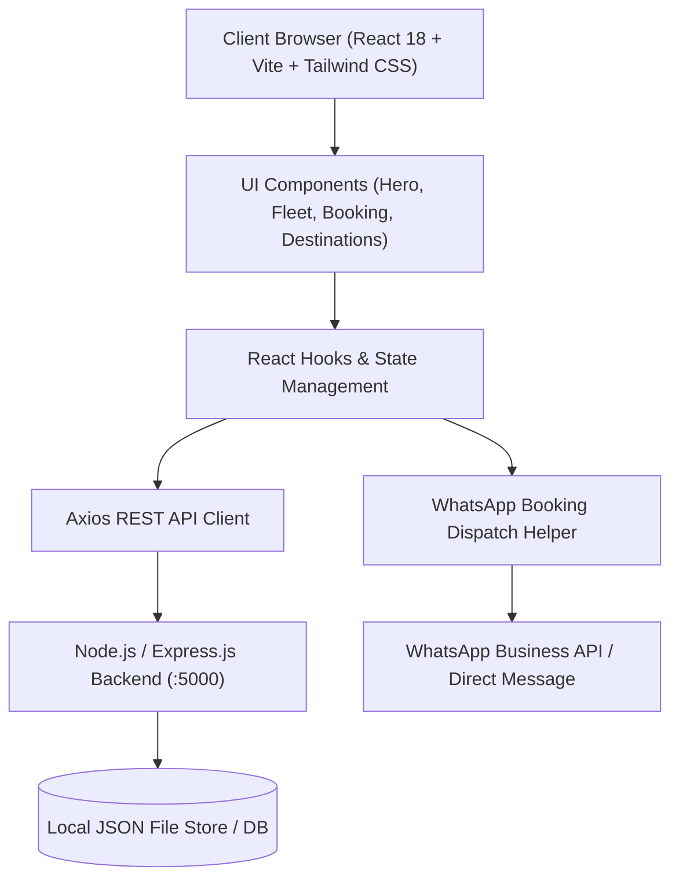

# 🚖 GURU TRAVEL — Comprehensive Project Report

---

## 1. Executive Summary

**Guru Travel** is a modern, full-stack vehicle rental and travel booking web application tailored specifically for the Bihar regional and inter-state tourism market (headquartered in **Vaishali, Bihar**). 

The platform connects travelers, families, corporate clients, and pilgrims with well-maintained chauffeur-driven vehicles ranging from affordable sub-compact sedans to rugged SUVs, spacious multi-purpose passenger vehicles (MPVs), and luxury executive cars.

```
┌───────────────────────────────────────────────────────────────────────────┐
│                           GURU TRAVEL PLATFORM                            │
│                  "Your Journey, Our Responsibility."                      │
│                      Founders: Reyaj & Sujeet                             │
│                  Location: Vaishali, Bihar, India                         │
│             Contact: +91 8578811081 | +91 919633384849                    │
│             Instagram: @gurutravel2026                                    │
└───────────────────────────────────────────────────────────────────────────┘
```

---

## 2. Project Architecture & Technology Stack



### 2.1 Technology Stack Details

| Layer | Technologies Used | Description |
|---|---|---|
| **Frontend Framework** | React 18, Vite 5.4 | High-performance Single Page Application (SPA) architecture |
| **Styling & Design** | Tailwind CSS 3.4, PostCSS | Responsive design system with custom amber/orange/slate palette |
| **Icons & Media** | Lucide React, Sharp, WebP | Modern iconography, lossless/near-lossless WebP image pipeline |
| **Backend API** | Node.js, Express.js, CORS | RESTful API for receiving and managing bookings |
| **Data Persistence** | File-based JSON Store (`server/data/bookings.json`) | Persistent lightweight storage for reservations and leads |
| **Integrations** | WhatsApp Direct Link API, Instagram API | One-click instant chat booking and social channels |

---

## 3. Core Modules & Feature Breakdown

### 3.1 Hero & Brand Identity
- **Official Banner Showcase**: Displays the official Guru Travel banner (`/guru-travel-banner.jpg`).
- **Leadership Recognition**: Highlights founders **Reyaj & Sujeet** (*"Thank you for choosing us!"*).
- **24/7 Action Buttons**: Quick-dial call links (`+91 8578811081`, `+91 919633384849`) and WhatsApp consultation.

### 3.2 Dynamic Quick Booking Engine
- **Trip Types**: Outstation Round-Trip, One-Way Drop, Local Hourly Rental, Airport Transfers.
- **Rental Modes**: 
  - *With Driver* (Active Chauffeur Service with experienced local drivers).
  - *Self-Drive* (Clearly designated as *"Coming Soon"* to manage user expectations).
- **Auto-Sync Vehicle Selection**: Seamlessly pre-fills vehicle selections when initiated from the Fleet section.
- **Dual-Channel Confirmation**:
  1. Submits lead payload to backend API (`POST /api/bookings`).
  2. Generates pre-formatted WhatsApp booking message for immediate customer support dispatch.

### 3.3 15-Vehicle Fleet Catalogue
The catalogue features 15 distinct, verified Indian-market vehicle models with complete technical specifications, capacity metrics, and local WebP photography:

```
Fleet Categories:
├── Sedan (Dzire, Tigor, Honda City)
├── Hatchback (Baleno, Fronx)
├── SUV (Brezza, S-Cross, Scorpio Classic, Scorpio-N, XUV 500, Bolero, Thar)
├── MPV (Ertiga, Toyota Innova)
└── Premium (BMW Luxury Sedan)
```

#### Detailed Fleet Specifications:

| # | Vehicle | Category | Capacity | Fuel / Trans | Features | Image File |
|---|---|---|---|---|---|---|
| 1 | **Maruti Suzuki Dzire** | Sedan | 4+1 Seats | Petrol/CNG • Manual/Auto | Dual Airbags, Best Mileage, High Boot Space | `dzire.webp` |
| 2 | **Tata Tigor** | Sedan | 4+1 Seats | Petrol/CNG • Manual/Auto | 4-Star Safety, Harman Audio, Plush Cabin | `tigor.webp` |
| 3 | **Honda City** | Sedan | 4+1 Seats | Petrol • Manual/CVT | Executive Comfort, Sunroof, Premium Rear Legroom | `honda-city.webp` |
| 4 | **Maruti Suzuki Baleno** | Hatchback | 4+1 Seats | Petrol • Manual/AGS | 360 Camera, 9" Screen, Fuel Efficient | `baleno.webp` |
| 5 | **Maruti Suzuki Fronx** | Hatchback | 4+1 Seats | Petrol/Turbo • MT/AT | High Ground Clearance, Crossover Styling | `fronx.webp` |
| 6 | **Maruti Suzuki Brezza** | SUV | 4+1 Seats | Petrol • Manual/AT | High Seating, Electric Sunroof, Robust Suspension | `brezza.webp` |
| 7 | **Maruti Suzuki S-Cross** | SUV | 4+1 Seats | Petrol • Manual/Auto | European Build, All 4 Disc Brakes, Highway Cruiser | `s-cross.webp` |
| 8 | **Mahindra Scorpio** | SUV | 7/9 Seats | Diesel • 6-Speed MT | Classic mHawk Engine, Heavy Duty Road Presence | `scorpio.webp` |
| 9 | **Mahindra Scorpio-N** | SUV | 6/7 Seats | Diesel/Petrol • MT/AT | Modern D-segment SUV, Command Seating, 4XPLOR | `scorpio-n.webp` |
| 10 | **Mahindra XUV 500** | SUV | 7 Seats | Diesel • Manual/Auto | Monocoque Comfort, Powerful Highway Performer | `xuv-500.webp` |
| 11 | **Mahindra Bolero** | SUV | 7 Seats | Diesel • 5-Speed MT | Rural/Semi-Urban King, Rugged Metal Bumpers | `bolero.webp` |
| 12 | **Mahindra Thar** | SUV | 4 Seats | 4x4 Diesel/Petrol • MT/AT | Off-road Legend, Iconic Styling, Adventure Ready | `thar.webp` |
| 13 | **Maruti Suzuki Ertiga** | MPV | 6+1 Seats | Petrol/CNG • Manual/AT | Supreme Family Comfort, Dual AC, Foldable 3rd Row | `ertiga.webp` |
| 14 | **Toyota Innova** | MPV | 7/8 Seats | Diesel • Manual/Auto | Unmatched Long-Distance Reliability, Captain Seats | `innova.webp` |
| 15 | **BMW** | Premium | 4+1 Seats | Turbo Petrol/Diesel • Auto | Luxury Chauffeur Experience, VIP & Wedding Travel | `bmw.webp` |

### 3.4 Key Destinations & Tour Packages
- **Patna**: Business, government travel, and airport pickups.
- **Gaya & Bodh Gaya**: International pilgrimage, Mahabodhi Temple, Vishnupad.
- **Rajgir & Nalanda**: Ancient university ruins, ropeway, hot springs, glass bridge.
- **Vaishali Heritage**: Ashoka Pillar, Buddha Relic Stupa, Mahavira birthplace.
- **Muzaffarpur & Mithila Corridor**: Commercial and cultural tours.

### 3.5 Operational Trust & Safety
- **Clean & Sanitized Fleet**: Every car sanitized before dispatch.
- **Transparent Pricing**: Fixed per-km and day packages with zero hidden charges.
- **Experienced Drivers**: Background-verified, polite, route-expert chauffeurs.
- **24/7 Breakdown Assistance**: Dedicated emergency roadside support across Bihar.

---

## 4. Directory & Codebase Structure

```text
guru-travel/
├── public/
│   ├── guru-travel-banner.jpg      # Official branding banner
│   └── images/
│       └── fleet/                  # 15 High-res Indian-market WebP vehicle images
│           ├── dzire.webp
│           ├── tigor.webp
│           ├── honda-city.webp
│           ├── baleno.webp
│           ├── fronx.webp
│           ├── brezza.webp
│           ├── s-cross.webp
│           ├── scorpio.webp
│           ├── scorpio-n.webp
│           ├── xuv-500.webp
│           ├── bolero.webp
│           ├── thar.webp
│           ├── ertiga.webp
│           ├── innova.webp
│           └── bmw.webp
├── src/
│   ├── components/
│   │   ├── Navbar.jsx              # Navigation header with direct contact CTA
│   │   ├── Hero.jsx                # Hero banner and quick booking trigger
│   │   ├── QuickBookingForm.jsx    # Complete booking form with auto-prefill
│   │   ├── FleetSection.jsx        # Category filtering and vehicle grid
│   │   ├── DestinationsSection.jsx # Bihar tour circuits and packages
│   │   ├── RentalModesSection.jsx  # With Driver vs Self-Drive breakdown
│   │   ├── ServicesSection.jsx     # Outstation, Local, Airport, Corporate
│   │   ├── WhyChooseUs.jsx         # Trust badges and key value props
│   │   ├── HowItWorks.jsx          # 4-step reservation journey
│   │   ├── TestimonialsSection.jsx # Verified customer feedback
│   │   ├── FaqSection.jsx          # Collapsible frequently asked questions
│   │   ├── ContactSection.jsx      # Direct inquiry form & Google Maps
│   │   ├── Footer.jsx              # Footer navigation and copyright
│   │   └── FloatingActions.jsx     # Floating WhatsApp, Call, & Instagram buttons
│   ├── data/
│   │   ├── fleet.js                # Canonical 15-vehicle dataset with specs & image paths
│   │   ├── destinations.js         # Tour circuit metadata
│   │   └── testimonials.js         # Reviews data
│   ├── utils/
│   │   └── whatsappHelper.js       # WhatsApp URL builder & validation helpers
│   ├── App.jsx                     # Top-level composition and layout
│   ├── index.css                   # Tailwind styles and custom utilities
│   └── main.jsx                    # React DOM root entry
├── server/
│   ├── index.js                    # Express REST API backend
│   └── data/
│       └── bookings.json           # Persistent booking records
├── scripts/
│   ├── replace_6_fleet_images.js   # Automated image optimizer & converter
│   └── update_indian_fleet_images.js
├── package.json                    # Dependencies and build scripts
├── vite.config.js                  # Vite configuration
└── tailwind.config.js              # Tailwind custom theme setup
```

---

## 5. Verification & Testing

### 5.1 Build & Asset Verification
- **Build Status**: `PASS` (`vite build` compiled 1,614 modules in under 3 seconds).
- **Bundle Sizes**:
  - `dist/index.html`: ~1.8 KB
  - `dist/assets/index.css`: ~41.5 KB (Gzip: 7.2 KB)
  - `dist/assets/index.js`: ~254.5 KB (Gzip: 71.1 KB)
- **Image Performance**: All 15 fleet assets are optimized into modern WebP format (averaging 50–150 KB per asset).

### 5.2 Functional Validation Matrix

| Test Scenario | Expected Outcome | Result |
|---|---|:---:|
| **Category Tabs** | Filters fleet by Sedan, Hatchback, SUV, MPV, Premium | ✅ PASS |
| **"Request Vehicle" Button** | Smoothly scrolls to booking form and pre-selects vehicle | ✅ PASS |
| **WhatsApp Dispatch** | Builds structured Hindi/English message to `+91 8578811081` | ✅ PASS |
| **Backend Persistence** | Saves booking payload into `server/data/bookings.json` | ✅ PASS |
| **Direct Call Links** | Initiates phone dialer to `+91 8578811081` / `+91 919633384849` | ✅ PASS |
| **Instagram Social Link** | Opens official `@gurutravel2026` profile in new tab | ✅ PASS |

---

## 6. Deployment & Running Guide

### 6.1 Prerequisites
- Node.js (v18 or higher recommended)
- npm (v9 or higher)

### 6.2 Development Mode
```bash
# In project root: C:\Users\razat\.gemini\antigravity\scratch\guru-travel
npm install

# Start development server
npm run dev

# Start backend server (optional, for persistent API logs)
npm run server
```

### 6.3 Production Build & Preview
```bash
# Build optimized assets
npm run build

# Preview production build locally
npm run preview
```

---

## 7. Conclusion & Future Roadmap

Guru Travel's web platform is production-ready, mobile-first, and highly optimized for performance and conversion.

### Recommended Next Steps:
1. **Self-Drive Module Activation**: Roll out security deposit handling and document KYC upload (Aadhaar / Driving Licence).
2. **Payment Gateway Integration**: Add Razorpay / UPI intent flows for booking advance tokens.
3. **SMS / Email Notifications**: Automated confirmation SMS upon booking submission.
4. **Driver Partner Portal**: Simple dashboard for assigning drivers to specific bookings.
